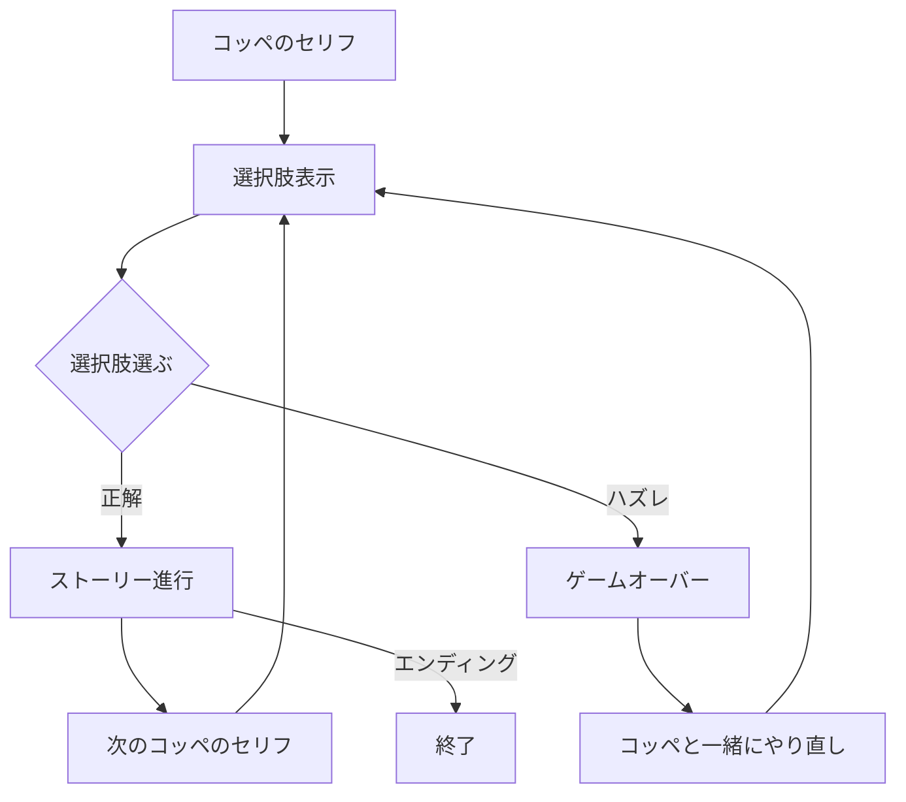

# ゲームコンセプト

## 用語定義
- **外側ゲーム**：プレイヤーとコッペの会話や選択肢、全体の進行を管理する本編部分を指す。
- **内側ゲーム**：外側ゲーム内でプレイされる、ノワが登場する恋愛ゲーム部分を指す（選択肢やストーリー分岐、ゲームオーバーなど）。

## 体験のコア
このゲームは「理不尽な恋愛ゲームを、友達（コッペ）と一緒にツッコミながら攻略する」体験を提供するノベルゲームです。  
プレイヤーはコッペと会話しながら、ゲーム内ゲーム（内側ゲーム）の選択肢を相談し、理不尽な展開や即ゲームオーバーに一緒に盛り上がることができます。

---

## 概要
このゲームは「ゲーム内で友達と一緒に内側ゲームをプレイしている」という設定のノベルゲームです。プレイヤーは友達キャラクターと一緒に、内側ゲームを進めていきます。

---

## 全体フロー

- セーブ・ロード不要
- タイトル画面不要
- コッペのセリフ→選択肢→ゲーム進行→またコッペと話す→エンディングで終了

---

詳細仕様・キャラクター・UI・実装方針については、  
以下のファイルを参照してください。

- [内側ゲーム仕様.md](内側ゲーム仕様.md)
- [キャラクターと会話.md](キャラクターと会話.md)
- [UIと実装仕様.md](UIと実装仕様.md)
