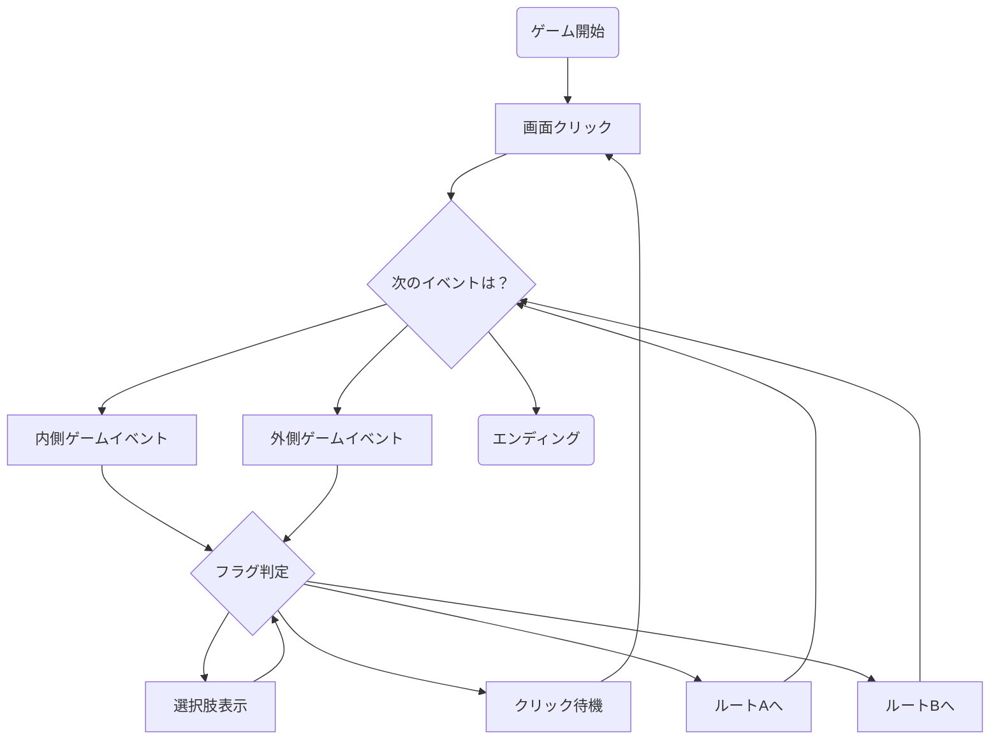

# ゲーム基本システムまとめ

---

## 1. プレイヤー操作

- 画面クリックでイベント進行
- 選択肢が出たときは選択肢を選ぶ

---

## 2. イベントの種類

- **内側ゲーム（ノワのゲーム）**
    - セリフ表示
    - オブジェクトの表示/非表示切り替え
    - 暗転・明転（画面のフェード）
- **外側ゲーム（コッペのゲーム）**
    - セリフ表示
    - 選択肢の表示（プレイヤーが選択可能な場合のみ）

---

## 3. イベント進行・分岐の流れ

- クリックごとに「次のイベント」を進行
- イベントは「内側」「外側」どちらにも発生
- 外側イベントが必ずしも選択肢に繋がるわけではなく、セリフだけで次のクリック待ちになる場合もある
- イベントの途中や終了時にフラグ判定が発生し、ルート分岐や次イベントの決定に使われる
    - フラグ判定は選択肢だけでなく、内側・外側のイベント進行中にも発生しうる
- 複数イベントの同時発生や、順序制御も可能

---

## 4. システム設計イメージ

---

## 5. ポイントまとめ

- 外側イベントは「セリフのみ」や「選択肢表示」など柔軟に制御
- フラグ判定はどのイベント過程でも発生し、分岐や次イベント決定に使う
- クリック進行・選択肢・フラグ・イベント制御がコア
