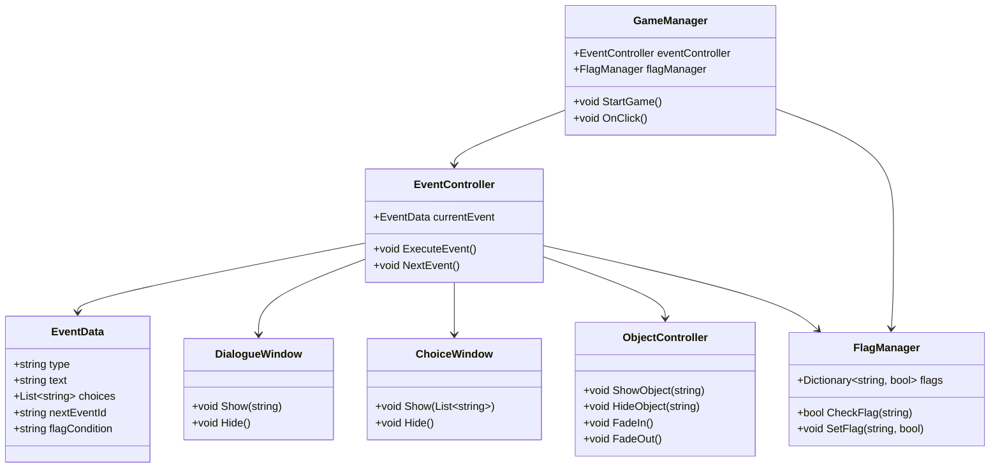

# ゲーム基本システム クラス設計案

---

## 1. 全体構成イメージ

- **GameManager**  
    ゲーム全体の進行・状態管理の中枢。イベント進行・分岐・フラグ管理を統括。

- **EventController**  
    現在のイベント（内側/外側/選択肢など）の実行・切り替えを担当。

- **EventData**  
    各イベントの内容・タイプ・遷移先・フラグ条件などを保持するデータクラス。

- **FlagManager**  
    ルート分岐や条件判定用のフラグを一元管理。

- **DialogueWindow**  
    セリフ表示UIの制御。内側/外側で使い分け可能。

- **ChoiceWindow**  
    選択肢UIの制御。

- **ObjectController**  
    内側ゲームのオブジェクト表示/非表示や演出制御。

---

## 2. クラス一覧と役割

| クラス名              | 役割・責務                                                                 |
|----------------------|----------------------------------------------------------------------------|
| GameManager          | ゲーム全体の進行・状態・イベント管理の中枢                                 |
| EventController      | 現在のイベントの実行・切り替え、イベント進行の制御                         |
| EventData            | イベントの種類・内容・遷移先・フラグ条件などのデータ保持                   |
| FlagManager          | ルート分岐や条件判定用のフラグ管理                                         |
| DialogueWindow       | セリフ表示UIの制御（内側/外側で使い分け）                                  |
| ChoiceWindow         | 選択肢UIの制御                                                             |
| ObjectController     | 内側ゲームのオブジェクト表示/非表示や演出制御                              |

---

## 3. クラス間の関係イメージ

---

## 4. ポイント

- **GameManager**が全体の進行・クリック受付・状態遷移を統括
- **EventController**がイベントの実行・切り替えを担当
- **EventData**でイベント内容・分岐条件・遷移先を柔軟に管理
- **FlagManager**で分岐フラグを一元管理
- UIやオブジェクト制御は専用クラスで分離し、責務を明確化

---

## 5. 拡張性

- イベントの種類追加や分岐ロジックの拡張が容易
- データ駆動型設計（EventData）でストーリーや演出の追加・修正がしやすい
- UIや演出のカスタマイズも各クラス単位で対応可能
